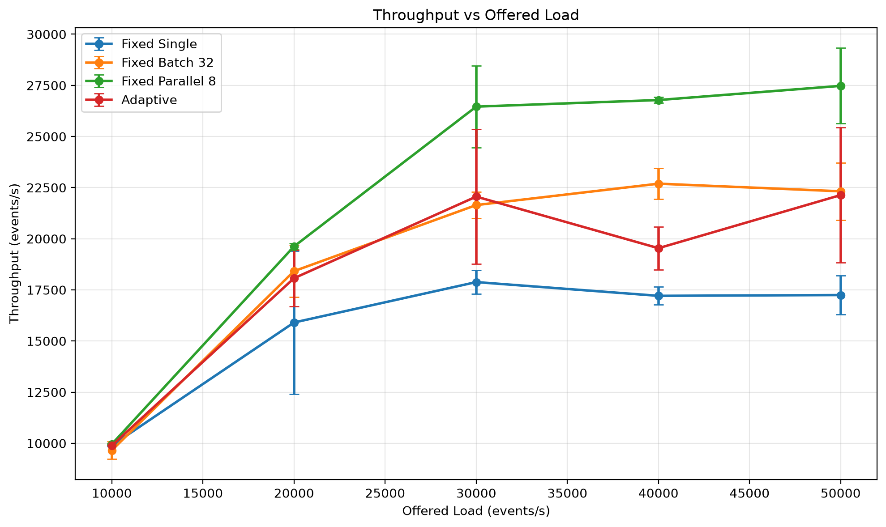
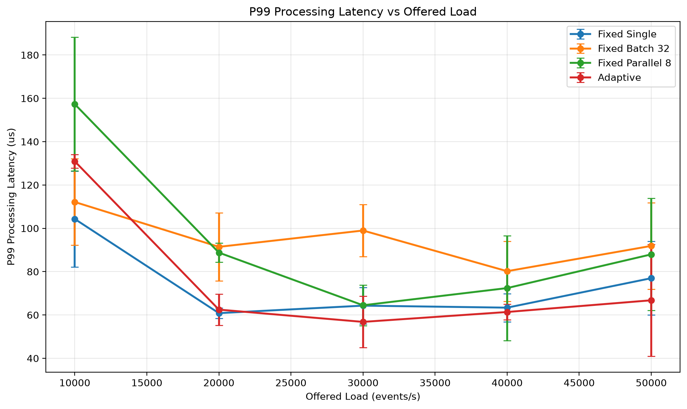
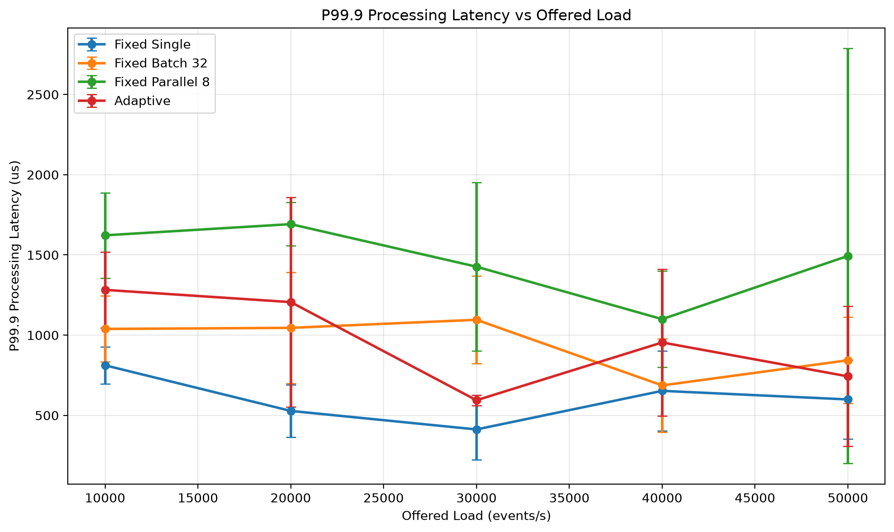
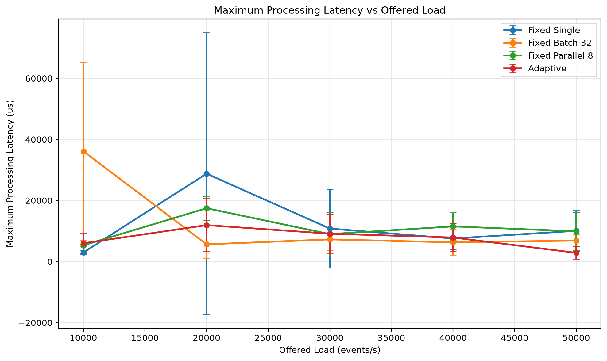
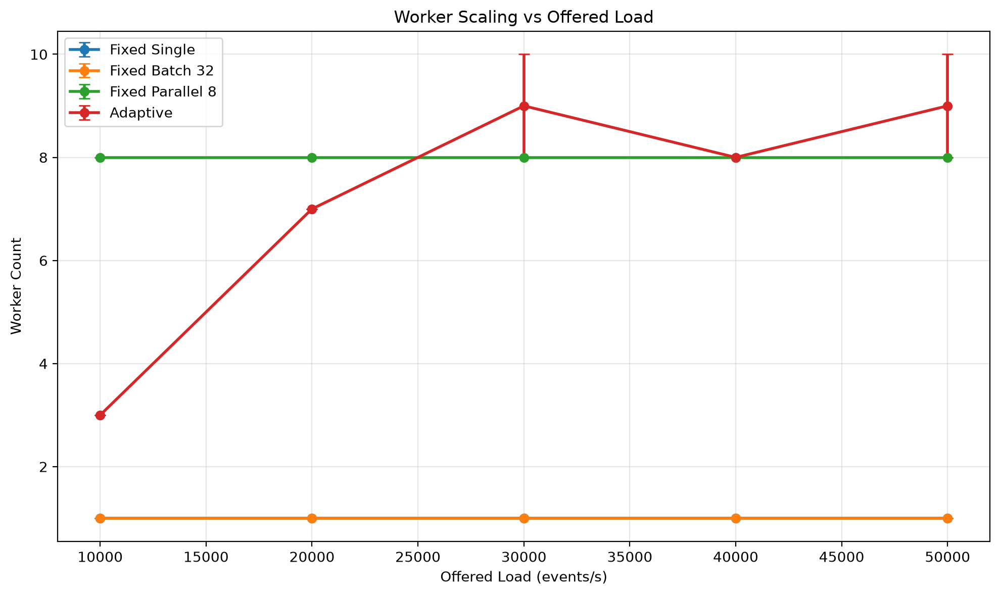
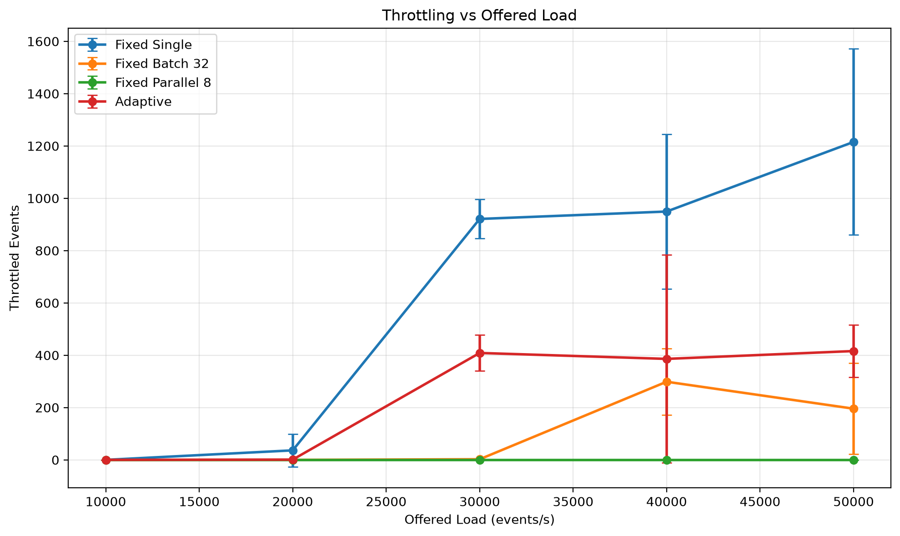
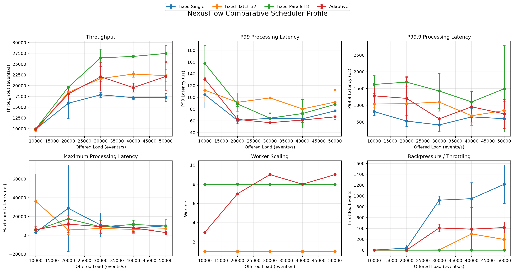

import csv
import math
import os
import statistics
from collections import defaultdict

try:
    from scipy.stats import wilcoxon
    SCIPY_AVAILABLE = True
except Exception:
    SCIPY_AVAILABLE = False

ROOT = r"C:\Users\PC\NexusFlow"

CSV_PATH = os.path.join(
    ROOT,
    "benchmarks",
    "results",
    "comparative_scheduler",
    "comparative_raw.csv"
)

OUT_DIR = os.path.join(
    ROOT,
    "benchmarks",
    "results",
    "comparative_scheduler",
    "analysis"
)

os.makedirs(OUT_DIR, exist_ok=True)

def normalize(name):
    return (
        name.strip()
        .lower()
        .replace(" ", "_")
        .replace("-", "_")
    )

def find_column(headers, aliases):
    normalized = {
        normalize(h): h
        for h in headers
    }

    for alias in aliases:
        key = normalize(alias)
        if key in normalized:
            return normalized[key]

    for header in headers:
        h = normalize(header)

        for alias in aliases:
            a = normalize(alias)

            if a in h or h in a:
                return header

    return None

with open(CSV_PATH, "r", newline="", encoding="utf-8-sig") as f:
    sample = f.read(4096)
    f.seek(0)

    try:
        dialect = csv.Sniffer().sniff(sample)
    except Exception:
        dialect = csv.excel

    reader = csv.DictReader(f, dialect=dialect)

    headers = reader.fieldnames or []

    print("Detected CSV columns:")
    for header in headers:
        print("  " + str(header))

    mode_col = find_column(
        headers,
        ["mode", "scheduler_mode", "processing_mode"]
    )

    rate_col = find_column(
        headers,
        ["target_rate", "target_rate_eps", "load_eps", "offered_rate", "rate"]
    )

    throughput_col = find_column(
        headers,
        ["throughput", "throughput_eps", "eps"]
    )

    p99_col = find_column(
        headers,
        ["p99", "p99_us", "p99_latency", "p99_latency_us"]
    )

    p999_col = find_column(
        headers,
        ["p99.9", "p99_9", "p999", "p999_us", "p99_9_us"]
    )

    max_col = find_column(
        headers,
        ["maximum_latency", "max_latency", "max_latency_us", "maximum_latency_us", "max_processing_latency_us"]
    )

    workers_col = find_column(
        headers,
        ["workers", "active_workers", "worker_count"]
    )

    throttled_col = find_column(
        headers,
        ["throttled", "throttled_events", "throttle_count"]
    )

    integrity_col = find_column(
        headers,
        ["integrity", "integrity_status"]
    )

    mapping = {
        "mode": mode_col,
        "target_rate": rate_col,
        "throughput": throughput_col,
        "p99": p99_col,
        "p999": p999_col,
        "max_latency": max_col,
        "workers": workers_col,
        "throttled": throttled_col,
        "integrity": integrity_col
    }

    print("")
    print("Detected column mapping:")

    for key, value in mapping.items():
        print("  " + key + " -> " + str(value))

    required = [
        "mode",
        "target_rate",
        "throughput",
        "p99"
    ]

    missing = [
        key
        for key in required
        if mapping[key] is None
    ]

    if missing:
        raise RuntimeError(
            "Missing required CSV columns: " + ", ".join(missing)
        )

    rows = []

    for raw in reader:
        try:
            mode = str(raw[mode_col]).strip()

            rate = float(raw[rate_col])
            throughput = float(raw[throughput_col])
            p99 = float(raw[p99_col])

            p999 = (
                float(raw[p999_col])
                if p999_col and raw.get(p999_col, "") != ""
                else 0.0
            )

            max_latency = (
                float(raw[max_col])
                if max_col and raw.get(max_col, "") != ""
                else 0.0
            )

            workers = (
                float(raw[workers_col])
                if workers_col and raw.get(workers_col, "") != ""
                else 0.0
            )

            throttled = (
                float(raw[throttled_col])
                if throttled_col and raw.get(throttled_col, "") != ""
                else 0.0
            )

            integrity = (
                str(raw[integrity_col]).strip()
                if integrity_col
                else "UNKNOWN"
            )

            rows.append({
                "mode": mode,
                "target_rate": rate,
                "throughput": throughput,
                "p99": p99,
                "p999": p999,
                "max_latency": max_latency,
                "workers": workers,
                "throttled": throttled,
                "integrity": integrity
            })

        except Exception:
            continue

if not rows:
    raise RuntimeError(
        "CSV was read successfully, but no valid benchmark rows were parsed."
    )

print("")
print("Parsed rows:", len(rows))

groups = defaultdict(list)

for row in rows:
    groups[(row["mode"], row["target_rate"])].append(row)

summary_path = os.path.join(
    OUT_DIR,
    "comparative_statistical_summary.csv"
)

with open(summary_path, "w", newline="", encoding="utf-8") as f:

    writer = csv.writer(f)

    writer.writerow([
        "mode",
        "target_rate",
        "runs",
        "mean_throughput",
        "std_throughput",
        "cv_throughput_percent",
        "mean_p99_us",
        "std_p99_us",
        "mean_p999_us",
        "mean_max_latency_us",
        "mean_workers",
        "mean_throttled",
        "integrity_rate_percent"
    ])

    for key in sorted(groups):

        mode, rate = key
        data = groups[key]

        throughputs = [
            x["throughput"]
            for x in data
        ]

        p99s = [
            x["p99"]
            for x in data
        ]

        p999s = [
            x["p999"]
            for x in data
        ]

        maxs = [
            x["max_latency"]
            for x in data
        ]

        workers = [
            x["workers"]
            for x in data
        ]

        throttled = [
            x["throttled"]
            for x in data
        ]

        mean_tp = statistics.mean(throughputs)

        std_tp = (
            statistics.stdev(throughputs)
            if len(throughputs) > 1
            else 0.0
        )

        cv = (
            std_tp / mean_tp * 100.0
            if mean_tp
            else 0.0
        )

        integrity_rate = (
            sum(
                x["integrity"].upper() == "PASS"
                for x in data
            )
            / len(data)
            * 100.0
        )

        writer.writerow([
            mode,
            int(rate),
            len(data),
            f"{mean_tp:.6f}",
            f"{std_tp:.6f}",
            f"{cv:.6f}",
            f"{statistics.mean(p99s):.6f}",
            f"{statistics.stdev(p99s) if len(p99s) > 1 else 0.0:.6f}",
            f"{statistics.mean(p999s):.6f}",
            f"{statistics.mean(maxs):.6f}",
            f"{statistics.mean(workers):.6f}",
            f"{statistics.mean(throttled):.6f}",
            f"{integrity_rate:.2f}"
        ])

comparisons = []

rates = sorted(
    set(
        x["target_rate"]
        for x in rows
    )
)

fixed_modes = [
    "FIXED_SINGLE",
    "FIXED_BATCH_32",
    "FIXED_PARALLEL_8"
]

for rate in rates:

    adaptive = groups.get(
        ("ADAPTIVE", rate),
        []
    )

    if not adaptive:
        continue

    for fixed_mode in fixed_modes:

        fixed = groups.get(
            (fixed_mode, rate),
            []
        )

        if not fixed:
            continue

        if len(adaptive) != len(fixed):
            continue

        adaptive_tp = [
            x["throughput"]
            for x in adaptive
        ]

        fixed_tp = [
            x["throughput"]
            for x in fixed
        ]

        adaptive_p99 = [
            x["p99"]
            for x in adaptive
        ]

        fixed_p99 = [
            x["p99"]
            for x in fixed
        ]

        adaptive_mean_tp = statistics.mean(
            adaptive_tp
        )

        fixed_mean_tp = statistics.mean(
            fixed_tp
        )

        adaptive_mean_p99 = statistics.mean(
            adaptive_p99
        )

        fixed_mean_p99 = statistics.mean(
            fixed_p99
        )

        throughput_delta = (
            (
                adaptive_mean_tp
                - fixed_mean_tp
            )
            / fixed_mean_tp
            * 100.0
        )

        p99_delta = (
            (
                adaptive_mean_p99
                - fixed_mean_p99
            )
            / fixed_mean_p99
            * 100.0
        )

        throughput_p = float("nan")
        p99_p = float("nan")

        if SCIPY_AVAILABLE:

            try:
                throughput_p = float(
                    wilcoxon(
                        adaptive_tp,
                        fixed_tp,
                        alternative="two-sided"
                    ).pvalue
                )
            except Exception:
                pass

            try:
                p99_p = float(
                    wilcoxon(
                        adaptive_p99,
                        fixed_p99,
                        alternative="two-sided"
                    ).pvalue
                )
            except Exception:
                pass

        comparisons.append({
            "target_rate": int(rate),
            "baseline": fixed_mode,
            "adaptive_mean_throughput": adaptive_mean_tp,
            "fixed_mean_throughput": fixed_mean_tp,
            "throughput_delta": throughput_delta,
            "adaptive_mean_p99": adaptive_mean_p99,
            "fixed_mean_p99": fixed_mean_p99,
            "p99_delta": p99_delta,
            "throughput_p": throughput_p,
            "p99_p": p99_p
        })

comparison_path = os.path.join(
    OUT_DIR,
    "adaptive_vs_fixed_wilcoxon.csv"
)

with open(
    comparison_path,
    "w",
    newline="",
    encoding="utf-8"
) as f:

    writer = csv.writer(f)

    writer.writerow([
        "target_rate",
        "fixed_mode",
        "adaptive_mean_throughput",
        "fixed_mean_throughput",
        "throughput_delta_percent",
        "adaptive_mean_p99_us",
        "fixed_mean_p99_us",
        "p99_delta_percent",
        "throughput_wilcoxon_p",
        "p99_wilcoxon_p"
    ])

    for x in comparisons:

        writer.writerow([
            x["target_rate"],
            x["baseline"],
            f"{x['adaptive_mean_throughput']:.6f}",
            f"{x['fixed_mean_throughput']:.6f}",
            f"{x['throughput_delta']:.6f}",
            f"{x['adaptive_mean_p99']:.6f}",
            f"{x['fixed_mean_p99']:.6f}",
            f"{x['p99_delta']:.6f}",
            (
                f"{x['throughput_p']:.6f}"
                if not math.isnan(x["throughput_p"])
                else "NA"
            ),
            (
                f"{x['p99_p']:.6f}"
                if not math.isnan(x["p99_p"])
                else "NA"
            )
        ])

report_path = os.path.join(
    OUT_DIR,
    "NexusFlow_Comparative_Statistical_Report.md"
)

with open(
    report_path,
    "w",
    encoding="utf-8"
) as f:

    f.write("# NexusFlow Comparative Statistical Report\n\n")

    f.write("## Experimental Design\n\n")
    f.write(
        "- Modes: FIXED_SINGLE, FIXED_BATCH_32, "
        "FIXED_PARALLEL_8, ADAPTIVE\n"
    )
    f.write(
        "- Target loads: 10K, 20K, 30K, 40K, 50K EPS\n"
    )
    f.write(
        "- Repetitions: 3 per mode/load combination\n"
    )
    f.write(
        "- Events per run: 10,000\n"
    )
    f.write(
        "- Statistical test: Wilcoxon signed-rank test\n"
    )
    f.write(
        "- Significance threshold: alpha = 0.05\n\n"
    )

    f.write("## Aggregate Results\n\n")

    f.write(
        "| Load | Mode | Mean Throughput EPS | "
        "Mean P99 us | Mean P99.9 us | "
        "Mean Workers | Mean Throttled |\n"
    )

    f.write(
        "|---:|---|---:|---:|---:|---:|---:|\n"
    )

    for key in sorted(groups):

        mode, rate = key
        data = groups[key]

        tp = statistics.mean(
            x["throughput"]
            for x in data
        )

        p99 = statistics.mean(
            x["p99"]
            for x in data
        )

        p999 = statistics.mean(
            x["p999"]
            for x in data
        )

        workers = statistics.mean(
            x["workers"]
            for x in data
        )

        throttled = statistics.mean(
            x["throttled"]
            for x in data
        )

        f.write(
            f"| {int(rate):,} | {mode} | "
            f"{tp:,.2f} | "
            f"{p99:,.2f} | "
            f"{p999:,.2f} | "
            f"{workers:.2f} | "
            f"{throttled:.2f} |\n"
        )

    f.write(
        "\n## ADAPTIVE vs Fixed Baselines\n\n"
    )

    f.write(
        "| Load | Baseline | Throughput Delta | "
        "P99 Delta | Throughput p | P99 p |\n"
    )

    f.write(
        "|---:|---|---:|---:|---:|---:|\n"
    )

    for x in comparisons:

        tp_p = (
            f"{x['throughput_p']:.6f}"
            if not math.isnan(x["throughput_p"])
            else "NA"
        )

        p99_p = (
            f"{x['p99_p']:.6f}"
            if not math.isnan(x["p99_p"])
            else "NA"
        )

        f.write(
            f"| {x['target_rate']:,} | "
            f"{x['baseline']} | "
            f"{x['throughput_delta']:+.2f}% | "
            f"{x['p99_delta']:+.2f}% | "
            f"{tp_p} | {p99_p} |\n"
        )

    f.write("\n## Statistical Interpretation\n\n")

    significant = []

    for x in comparisons:

        if (
            not math.isnan(x["throughput_p"])
            and x["throughput_p"] < 0.05
        ):
            significant.append(
                "Throughput at "
                f"{x['target_rate']:,} EPS versus "
                f"{x['baseline']}"
            )

        if (
            not math.isnan(x["p99_p"])
            and x["p99_p"] < 0.05
        ):
            significant.append(
                "P99 latency at "
                f"{x['target_rate']:,} EPS versus "
                f"{x['baseline']}"
            )

    if significant:

        f.write(
            "Statistically significant results at "
            "alpha = 0.05:\n\n"
        )

        for item in significant:
            f.write("- " + item + "\n")

    else:

        f.write(
            "No comparison reached p < 0.05. "
            "The experiment therefore does not provide "
            "sufficient statistical evidence to claim "
            "ADAPTIVE superiority over the fixed baselines. "
            "Observed differences should be treated as "
            "descriptive rather than statistically established "
            "effects.\n"
        )

    f.write("\n## Reproducibility\n\n")

    f.write(
        "The analysis uses the existing comparative_raw.csv "
        "without generating additional benchmark runs.\n"
    )

print("")
print("STATISTICAL ANALYSIS: PASS")
print("")
print("Parsed rows:", len(rows))
print("")
print("Generated:")
print(summary_path)
print(comparison_path)
print(report_path)
print("")
print("SciPy available:", SCIPY_AVAILABLE)
---

## Comparative Scheduler Experiment

NexusFlow was evaluated against three fixed scheduling baselines:

- `FIXED_SINGLE`
- `FIXED_BATCH_32`
- `FIXED_PARALLEL_8`
- `ADAPTIVE`

The experiment used offered loads of 10,000, 20,000, 30,000, 40,000, and 50,000 events per second. Each mode/load combination was repeated three times, producing 60 benchmark runs in total.

### Comparative Throughput

The adaptive scheduler demonstrated strong throughput relative to the single-worker and fixed-batch strategies at several offered loads. However, the fixed eight-worker parallel configuration achieved higher raw throughput at 30K, 40K, and 50K EPS in this experiment.

Therefore, the results should not be interpreted as proof that adaptive scheduling universally maximizes throughput. Instead, they demonstrate that the adaptive scheduler dynamically changes worker capacity and maintains competitive throughput while applying backpressure under overload.

### P99 Processing Latency

P99 processing latency remained in the tens of microseconds across the tested operating region. The adaptive scheduler produced:

| Offered Load | Adaptive Mean P99 |
|---:|---:|
| 10K EPS | 130.92 us |
| 20K EPS | 62.47 us |
| 30K EPS | 56.80 us |
| 40K EPS | 61.37 us |
| 50K EPS | 66.77 us |

### P99.9 Processing Latency

P99.9 latency exposes tail behavior beyond P99 and is therefore retained as a separate research metric.

### Maximum Processing Latency

Maximum observed processing latency is reported separately from percentile latency because a single extreme observation can be hidden by percentile aggregation.

### Adaptive Worker Scaling

The adaptive scheduler changed worker capacity according to workload pressure rather than maintaining a fixed worker count.

Observed mean worker counts:

| Offered Load | Adaptive Workers |
|---:|---:|
| 10K EPS | 3 |
| 20K EPS | 7 |
| 30K EPS | 9 |
| 40K EPS | 8 |
| 50K EPS | 9 |

### Backpressure and Throttling

Throttling increased when the offered workload exceeded the sustainable processing capacity of the benchmark environment. This provides direct evidence that the pipeline is not simply accepting unlimited work when overloaded.

### Comparative Experimental Interpretation

The Wilcoxon signed-rank analysis did not produce any comparison with `p < 0.05`. Consequently, this experiment does not provide sufficient statistical evidence to claim statistically significant adaptive-scheduler superiority over the fixed baselines.

The observed differences are therefore treated as descriptive engineering results rather than statistically established effects.

This distinction is important because the experiment uses only three repetitions per condition. A larger number of independent repetitions would provide greater statistical power for future evaluation.

### Reproducibility

The canonical raw dataset is:

`benchmarks/results/comparative_scheduler/comparative_raw.csv`

The aggregate analysis is:

`benchmarks/results/comparative_scheduler/comparative_aggregate.csv`

Statistical outputs are stored under:

`benchmarks/results/comparative_scheduler/analysis/`

The visualization artifacts are stored under:

`benchmarks/results/comparative_scheduler/plots/`

The plots use the canonical comparative benchmark data and do not generate additional benchmark runs.

### Comparative Profile

The complete six-metric visualization combines throughput, P99, P99.9, maximum latency, worker scaling, and throttling into one research figure.

---

## Current Research Status

The comparative scheduler experiment, statistical analysis, maximum-latency validation, and visualization pipeline are complete.

The current evidence supports the following claims:

1. NexusFlow has a functioning adaptive scheduling control loop.
2. Worker capacity changes dynamically with workload pressure.
3. The system implements backpressure under overload.
4. Processing latency is instrumented through high-percentile and maximum measurements.
5. The benchmark pipeline records real throughput, processing, throttling, worker, and integrity metrics.
6. Comparative experiments are reproducible from the canonical raw CSV.
7. Statistical testing is implemented and reports non-significant results conservatively.

The experiment does **not** establish universal adaptive superiority.

The next major engineering stage is integration with real streaming infrastructure.

---

## Next Engineering Stage: Kafka / Redpanda Streaming

The next milestone is to replace the current benchmark-oriented event submission path with a real streaming ingestion layer.

Target architecture:

`Event Source -> Kafka/Redpanda Producer -> Topic -> Partition -> NexusFlow Consumer -> Adaptive Scheduler -> Worker Pool`

The Kafka/Redpanda layer will provide:

- topic-based event ingestion
- partitioned event streams
- consumer groups
- configurable partition counts
- producer rate control
- consumer-side backpressure
- offset management
- replayable workloads
- integration testing
- streaming failure experiments

The existing adaptive scheduler and worker pipeline remain the processing core.

The integration should preserve the current benchmark metrics so that the same throughput and tail-latency methodology can be applied after introducing the streaming layer.
